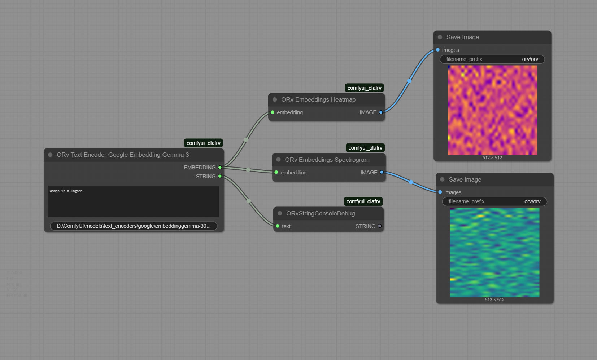

# ComfyUI Olaf's Nodes (ORv)

## Workflow

### Image Processing Nodes

* **ORvEmbeddingsHeatmap**: Converts an embedding tensor into a heatmap image for visualization.
* **ORvEmbeddingsSpectrogram**: Converts an embedding tensor into a spectrogram-like image for visualization.
* **ORVImageSizeBestFitResolution**: Resizes an image to fit the next available SDXL resolution while maintaining aspect ratio.

### Text Processing Nodes

* **ORvTextEncoderGoogleEmbeddingGemma3**: Encodes text into an embedding tensor using [Google's Embedding Gemma 3 model](https://huggingface.co/google/embeddinggemma-300m).
* **ORvStringConsoleDebug**: Prints a text string to the ComfyUI console.
* **ORvTextStripNonLatin**: Strips all non-Latin characters (Chinese, Japanese, Korean, Arabic, etc.) from text, useful for preventing file I/O encoding errors.

### Example Workflow

Download [ORv_Google_Embedding_Gemma3.json](src/comfyui_olafrv/assets/ORv_Google_Embedding_Gemma3.json) or the image below, and drag it into ComfyUI workflow canvas.



## Setup

### Download the Model

**Option A: Using Python (Recommended)**
```bash
cd /path/to/ComfyUI
# Activate your ComfyUI virtual environment if applicable
python -c "from huggingface_hub import snapshot_download; snapshot_download(repo_id='google/embeddinggemma-300m', local_dir='models/text_encoders/google/embeddinggemma-300M')"
```

**Option B: Using Hugging Face CLI**
```bash
cd /path/to/ComfyUI
# Activate your ComfyUI virtual environment if applicable
huggingface-cli download google/embeddinggemma-300m --local-dir models/text_encoders/google/embeddinggemma-300M
```

**Windows PowerShell Example:**
> Requires Python 3.12+ and `huggingface_hub` package installed in your ComfyUI virtual environment.

```powershell
cd "D:\ComfyUI"
& "D:\ComfyUI\.venv\Scripts\Activate.ps1"
python -c "from huggingface_hub import snapshot_download; snapshot_download(repo_id='google/embeddinggemma-300m', local_dir='models/text_encoders/google/embeddinggemma-300M')"
```

### Installation
- Install [ComfyUI](https://docs.comfy.org/get_started).
- Install [ComfyUI-Manager](https://github.com/ltdrdata/ComfyUI-Manager).
- Look up this extension in ComfyUI-Manager. If you are installing manually,
   download the zip or clone this repository under `ComfyUI/custom_nodes`.
- Restart ComfyUI.

## Development Setup

### Prerequisites

To set up your development environment, run the following commands:

```bash
pip install -e ".[dev]"
pre-commit install
python -m pytest .\tests\ -s
```

The `-e` flag above will result in a "live" install, in the sense that any
changes you make to your node extension will automatically be picked up 
the next time you run ComfyUI.

Adjust `.vscode/*.json` if you use VSCode.

## Tests

This repo contains unit tests written in Pytest in the `tests/` directory. 
It is recommended to unit test your custom node.

- [build-pipeline.yml](.github/workflows/build-pipeline.yml) will run 
  pytest and linter on any open PRs
- [validate.yml](.github/workflows/validate.yml) will run 
  [node-diff](https://github.com/Comfy-Org/node-diff) to check for breaking changes

### Sample Run

```powershell
(.venv) PS D:\ComfyUI\custom_nodes\comfyui_olafrv> python -m pytest .\tests -s
=== test session starts ===
platform win32 -- Python 3.12.9, pytest-8.4.1, pluggy-1.6.0
rootdir: D:\ComfyUI\custom_nodes\comfyui_olafrv
configfile: pyproject.toml
plugins: anyio-4.10.0, hydra-core-1.3.2
collecting ... Checking path: D:\ComfyUI\models\text_encoders
Found existing model path: D:\ComfyUI\models\text_encoders\google\embeddinggemma-300M
collected 3 items                                                

tests\test_comfyui_olafrv_nodes.py .Input types: {'required': {'text': ('STRING', {'multiline': True, 'dynamicPrompts': False, 'tooltip': 'Text to be encoded into a pytorch tensor'})}, 'optional': {'model_path': ('STRING', {'default': 'D:\\ComfyUI\\models\\text_encoders\\google\\embeddinggemma-300M', 'tooltip': 'Path to the Google Embedding Gemma 3 model'})}}
Test text: 'woman\nin a\nlagoon'
Device: cuda
Model: SentenceTransformer(
  (0): Transformer({'max_seq_length': 2048, 'do_lower_case': False, 'architecture': 'Gemma3TextModel'})
  (1): Pooling({'word_embedding_dimension': 768, 'pooling_mode_cls_token': False, 'pooling_mode_mean_tokens': True, 'pooling_mode_max_tokens': False, 'pooling_mode_mean_sqrt_len_tokens': False, 'pooling_mode_weightedmean_tokens': False, 'pooling_mode_lasttoken': False, 'include_prompt': True})
  (2): Dense({'in_features': 768, 'out_features': 3072, 'bias': False, 'activation_function': 'torch.nn.modules.linear.Identity'})
  (3): Dense({'in_features': 3072, 'out_features': 768, 'bias': False, 'activation_function': 'torch.nn.modules.linear.Identity'})
  (4): Normalize()
)
Model parameters: 307581696
Input Text: woman
in a
lagoon
Cleaned Text: 'woman
in a
lagoon'
(Pooled) Embeddings (Shape): torch.Size([768])
Embedding Tensor (Before Reshape): torch.Size([768])
Embedding Tensor (After Reshape): torch.Size([1, 1, 768])
Embedding shape: torch.Size([1, 1, 768]), dtype: torch.float32
String output: tensor([[[-1.5428e-01,  1.4719e-02,  1.5556e-02,  1.4291e-03, -3.3863e-02,
           7.7962e-02, -2.9351e-02,  2.5928e-02,  3.6877e-02, -5.1174e-02,
(...)
          -8.1964e-02, -6.6975e-03,  2.4878e-02]]], device='cuda:0')

shape: torch.Size([1, 512, 512, 3]), dtype: torch.float64
file: D:\ComfyUI\custom_nodes\comfyui_olafrv\tests\test_heatmap.png
hash(buffer): 28d7496a6b028e618911e30c0907f5423c1d44e6f23e95217ab39066d1958787
preview with 'catimage' library:
(...)

shape: torch.Size([1, 512, 512, 3]), dtype: torch.float64
file: D:\ComfyUI\custom_nodes\comfyui_olafrv\tests\test_spectrogram.png
hash(buffer): ace92f8bfbe0954fdc1d8254855871acdb2bf9ffe0f12d9a47ee150809cc3cd7
preview with 'catimage' library:
(...)
Node test completed!
.
tests\test_comfyui_olafrv_wf.py .

=== 3 passed in 10.67s ===
```

## References

* [ComfyUI Documentation](https://docs.comfy.org)
* [ComfyUI GitHub Repository](https://github.com/ltdrdata/ComfyUI)
* [ComfyUI Essentials: Custom Node Overview](https://docs.comfy.org/essentials/custom_node_overview)
* [cookiecutter](https://github.com/Comfy-Org/cookiecutter-comfy-extension)
* [ComfyUI Registry Documentation](https://docs.comfy.org/registry/publishing)
* [Create an API Key for Publishing](https://docs.comfy.org/registry/publishing#create-an-api-key-for-publishing)